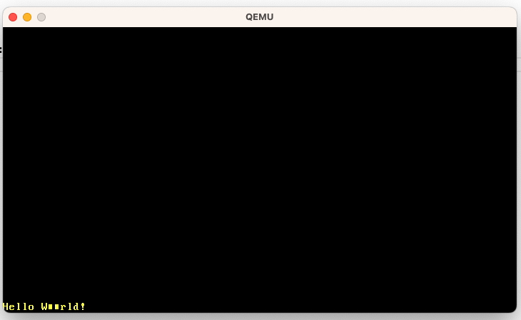

# VGA テキストモード

https://os.phil-opp.com/ja/vga-text-mode/

## VGAテキストバッファ

- 25行x80列の2時限配列

|ビット|値|
|:----|:----|
|0-7 | ASCIIコードポイント|
|8-11 | 前景色（フォアグラウンド）|
|12-14 | 背景色（バックグラウンド）|
|15 | 点滅 |

- 最初から 1 byte = 出力文字の ASCIIコード（コードページ437
- 次の 1 byte = 前半4bitで文字色、後半3bitで背景色、最後の1bitで点滅するかどうか
- 色の4bit目は bright bit で明るくするかどうか（文字色
- 点滅は背景色にしかないよ
- Memory Mapped I/O=ハードウェアのテキストバッファを抽象化して、通常のRAM操作との違いを意識しなくておk
    - ただし、RAM操作全部をサポートしているわけではない
- テキストバッファは通常の読み書きをサポートしてるのであんま問題なし

## Rust Module

- 最終的に unsafe な操作をモジュール内に隠蔽して外部からは普通の Rustモジュールとして使うだけでOKにする
- repr is 何
    - https://doc.rust-lang.org/nomicon/other-reprs.html#reprtransparent




### Volatile

- Bufferに書き込むが読み込めない
    - そのため、コンパイラはVGAバッファメモリにアクセスしてることを知らない
    - したがって文字が出力されるという副作用も知らない
    - 最適化の対象となり省略可能と判断される可能性がある
- `volatile` は最適化の対象から外す命令
    - 専用クレートがある

```toml
[dependencies]
volatile = "0.2.6"
```